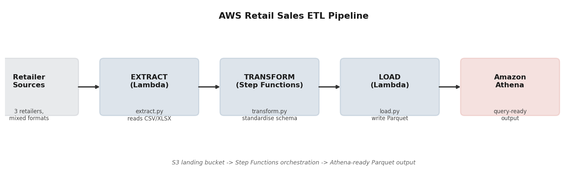

# AWS Retail Sales ETL Pipeline (Demo)


A demonstration of the ETL pipeline pattern built and maintained in a production data analyst role: ingesting inconsistent multi-retailer sales files, standardising them into one unified schema, and loading query-ready output for analytics.

> This is a generic, from-scratch demo built to show the pattern and architecture. It doesn't contain any real company data, retailer names, or infrastructure details, and runs entirely on local synthetic data instead of live AWS resources.

## Architecture



## Pipeline stages

| Stage | File | What it does |
|---|---|---|
| **Extract** | `extract.py` | Reads raw retailer export files, handling different formats (CSV with different delimiters, Excel exports with junk header rows). In production, this runs as an AWS Lambda function triggered by new files landing in an S3 bucket, populated automatically by an Outlook connector that retrieves retailer email attachments, including password-protected ones. |
| **Transform** | `transform.py` | Standardises each retailer's inconsistent column names, date formats (ISO vs. European vs. US), and decimal separators (comma vs. period) into one unified schema, with basic data-quality validation to drop malformed rows. |
| **Load** | `load.py` | Writes the unified dataset as partitioned CSV/Parquet, ready to be queried directly through **Amazon Athena**. |
| **Orchestration** | `step_functions_state_machine.json` | An AWS **Step Functions** state machine definition showing how the three stages are chained together in production, with retry logic and failure notifications via SNS. |

## Tools used

Python, pandas, AWS Lambda, AWS Step Functions, Amazon S3, Amazon Athena, Parquet

## How to run the local demo

```bash
pip install pandas openpyxl pyarrow
python generate_sample_retailer_files.py   # creates messy sample retailer files
python load.py                              # runs the full extract -> transform -> load pipeline
```

Output lands in `./warehouse/sales_unified.csv` and `.parquet`.

## Background

This mirrors the ETL pipeline built and maintained as a Working Student Data Analyst, which ingests sales data from 21 DACH retailers, standardises 12+ inconsistent PDF and Excel formats, and generates price and sellout reports in Amazon Athena across 4M+ rows.
